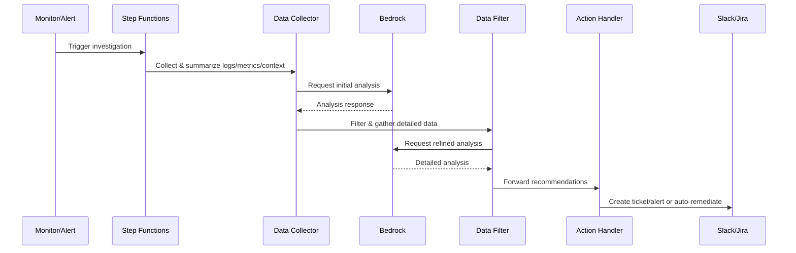
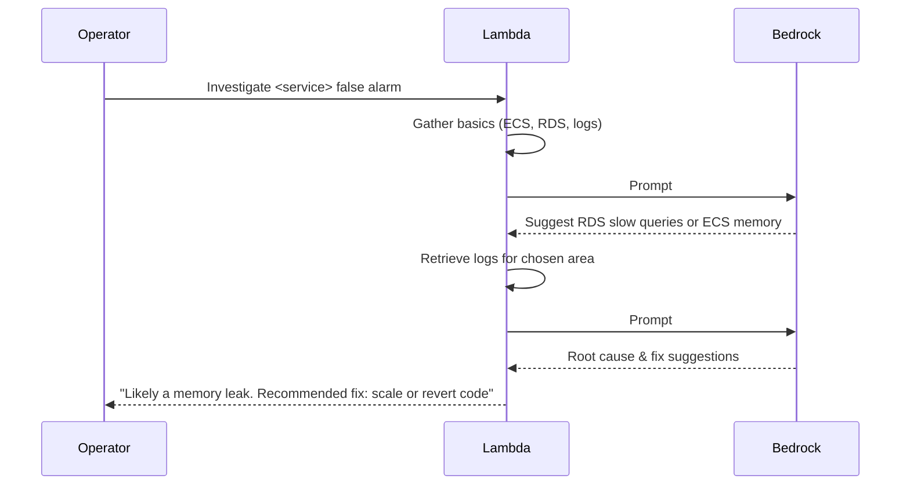

# AI Ops Agent for Automated Troubleshooting Using AWS Bedrock

## Overview

This document introduces an intelligent **AI Ops Agent** built on AWS Bedrock that revolutionises cloud application troubleshooting. By leveraging the advanced capabilities of **Claude** and **Nova** models, the agent can:

- Automatically detect and diagnose operational issues
- Execute targeted investigations based on system context
- Propose and implement solutions in real time
- Integrate seamlessly with existing monitoring and ticketing systems

The design emphasises modularity and extensibility, making it easy to enhance or customise the agent’s capabilities as your needs evolve.

---

## High-Level Goals

1. **Automate Troubleshooting**  
   Reduce the need for human intervention by guiding investigations into potential outages or performance bottlenecks.

2. **Multi-Model Flexibility**  
   Seamlessly switch between Claude and Nova on Bedrock, enabling the agent to capitalise on each model’s strengths.

3. **Context-Aware Analysis**  
   Incorporate details such as application architecture, recent deployments, or unique logs and metrics to provide targeted, relevant insights.

4. **Scalable and Modular**  
   Use AWS serverless constructs (e.g. Step Functions and Lambda) and keep each part of the workflow loosely coupled. This ensures components can be refined or swapped with minimal impact.

5. **Adaptive Learning**  
   Iteratively refine queries (prompts) based on partial results, letting the agent decide which logs or metrics to retrieve and analyse next.

---

## High-Level Architecture



1. **Trigger**  
   Either a monitoring alert (e.g. CloudWatch) or an operator manually requests help from the agent.

2. **Data Gathering**  
   The workflow aggregates context: system architecture, logs, metrics, any relevant deployment history.

3. **Initial Analysis**  
   The agent sends a prompt to AWS Bedrock (using either Claude or Nova), asking which logs or metrics appear most suspicious or relevant.

4. **Refined Analysis**  
   Based on the AI’s suggestions, more specific data is collected (for example, logs from a particular ECS service or deeper RDS metrics). Another AI request pinpoints possible root causes.

5. **Outcome**  
   The agent produces recommended actions (scale resources, revert a deployment, contact SRE on-call) and can automatically post updates to Slack or open a Jira ticket.

---

## Detailed System Flow

### Step 1: Start and Context Retrieval

**Goal:** Obtain enough context for the agent to meaningfully analyse the situation.

- **Inputs:**

  - High-level incident description ("Slow response times on user-profile endpoints").
  - Architecture data (services involved, dependencies, environment).

- **Process:**
  - A Lambda (or direct Step Functions task) fetches relevant background details (such as ECS tasks, RDS usage stats, recent deployment changes).
  - A short summary is created, focusing on what the agent should know (services, average throughput, critical logs if obviously relevant).

### Step 2: Initial Prompt to Bedrock

**Goal:** Ask the LLM where to dig deeper.

- **Prompt Example:**

  ```
  "We see a potential outage for user-profile-service. CloudWatch shows slight CPU spikes but no direct errors.
   The service is behind an API Gateway, using RDS for data storage. What should we investigate first?"
  ```

- **AI Model Integration:**
  - An adapter is chosen based on whether we use Claude or Nova.
  - Claude might require a JSON schema with `anthropic_version` and `messages`, while Nova might need a different request structure.
  - A common `bedrock_invoke(prompt, model_type)` method hides these differences under the hood.

### Step 3: Filter & Collect Detailed Data

**Goal:** Narrow the search using AI feedback.

- **Activities:**
  - If the AI says "Check RDS slow-query logs," the agent fetches them for the relevant timeframe.
  - If it mentions "Memory usage might be an issue," it grabs ECS container metrics.
  - Large data sets are summarised (for example, grouping repeated errors or ignoring unimportant lines) to keep prompts concise and cost-effective.

### Step 4: Second Prompt (Refined Analysis)

**Goal:** Provide the newly gathered, summarised data to the LLM for deeper insight.

```
"We collected the last 500 lines of logs from the user-profile-service.
Key points:
- 10 slow queries (avg 400ms)
- 3 out-of-memory kills on ECS
What is the likely cause and next step?"
```

- **AI Response:**
  - Might propose root causes such as "High concurrency leads to OOM," "Inefficient queries," or "Possible memory leak post-latest deployment."

### Step 5: Actions/Outcomes

**Goal:** Turn AI outputs into practical results.

- If the agent is **semi-autonomous**, it may:
  - Create a Jira ticket referencing recommended fix steps.
  - Post a Slack alert with bullet points.
  - Trigger a rollback or scale up the ECS service.
- If fully autonomous, it could remediate automatically when confidence is high.

---

## Implementation Details

### Core Components

1. **AWS Lambda**

   - Runs the logic that collects metrics/log data, constructs prompts, and calls Bedrock.
   - Multiple Lambdas can be orchestrated by Step Functions if multi-step flows are needed (for example, initial analysis vs refined analysis).

2. **AWS Step Functions**

   - Maintains state across multiple AI calls.
   - Branching logic if the AI suggests investigating one service over another.

3. **Bedrock Adapter**

   - A simple Ruby class that creates the correct JSON payload for Claude or Nova and parses the response.
   - Minimises repeated code for formatting prompts.

4. **Summarisation Module**
   - Filters large logs or metrics into a short form that is easy for the LLM to parse.
   - Could use various heuristics (for example, keep lines with "ERROR" or "WARN," group similar errors, or summarise repeated patterns).

### Sample Adapter Snippet

```ruby
class ClaudeAdapter
  def format_request(prompt_text)
    {
      anthropic_version: "bedrock-2023-05-31",
      max_tokens: 300,
      messages: [
        { role: "user", content: prompt_text }
      ]
    }
  end

  def parse_response(response_body)
    parsed = JSON.parse(response_body)
    parsed["content"][0]["text"]
  end
end

class NovaAdapter
  def format_request(prompt_text, system_text = "You are an AI assistant.")
    {
      messages: [
        {
          role: "user",
          content: [{ text: prompt_text }]
        }
      ],
      system: [
        { text: system_text }
      ],
      inferenceConfig: {
        temperature: 0.7,
        topP: 0.9,
        maxTokens: 300
      }
    }
  end

  def parse_response(response_body)
    parsed = JSON.parse(response_body)
    parsed.dig("output", "message", "content")&.first&.dig("text")
  end
end
```

A factory function or class picks which adapter to use based on `model_type`.

---

## Possible Expansion

- **Knowledge Base**  
  Store solutions from prior incidents, letting the agent cross-reference older root causes or known fixes.

- **User Interaction**  
  Provide a chat interface where SREs can ask the agent direct questions ("What changed in the last 24 hours?") and see short, summarised answers.

- **Multi-Model**  
  Use Nova for quick or cost-sensitive checks, switch to Claude for more nuanced or complex reasoning tasks.

- **Auto-Remediation**  
  If the agent sees a recurring memory leak it is confident about, it can automatically scale or redeploy.

---

## Security & Compliance

- **IAM Roles & Permissions**

  - Detailed breakdown of required IAM policies for Lambda functions.
  - Principle of least privilege, ensuring each Lambda or Step Function can only access necessary resources.

- **Data Privacy**

  - Handling of sensitive information in logs (for example, masking credentials).
  - Data retention policies, especially for stored logs or summarised data.
  - PII or PHI considerations, ensuring no prohibited data is passed to the LLM.

- **Audit Trail**
  - Logging of AI decisions and actions for traceability.
  - Tracking automated remediation attempts, including who approved or triggered them.

---

## Error Handling & Resilience

- **Failure Modes**

  - Bedrock API unavailability or throttling.
  - Timeout scenarios in Lambda or Step Functions.
  - Invalid or incomplete context data leading to poor AI output.

- **Circuit Breakers**
  - Fallback mechanisms when AI analysis fails or times out.
  - Rate limiting for automated remediation to avoid repetitive or looping fixes.
  - Graceful degradation if an entire investigative workflow stalls.

---

## Cost Considerations

- **Token Usage Optimisation**

  - Strategies for minimising prompt length (for example, summarising logs).
  - Caching common responses if the scenario repeats (known error patterns).

- **Resource Utilisation**

  - Lambda concurrency planning to handle bursts of incidents.
  - Step Functions execution costs (especially if multi-step or high frequency).
  - Bedrock API cost estimates, particularly if the system scales out.

- **Budget Alerts**
  - AWS Budgets or CloudWatch metrics to raise alerts if monthly cost thresholds approach or exceed.

---

## Testing & Validation

- **Unit Testing**

  - Mock responses for Bedrock API calls.
  - Test coverage for adapters and summarisation logic.

- **Integration Testing**

  - End-to-end workflow validation across Step Functions, Lambdas, and the AI.
  - Chaos engineering scenarios (for example, artificially failing part of the system to confirm graceful fallback).

- **Validation Metrics**
  - Success rate of automated diagnosis (correct root cause identification).
  - False positive or negative tracking, ensuring AI does not overreact to normal spikes.
  - Time to resolution improvements, measured pre- and post-automation.

---

## Deployment & Operations

- **CI/CD Pipeline**

  - Infrastructure as Code (for example, CloudFormation, Terraform).
  - Automated testing and linting for code and prompt templates.
  - Blue/Green or canary deployments for safe rollout of new AI logic.

- **Monitoring**

  - Key metrics for agent performance (number of successful investigations, average diagnostic time).
  - Alert thresholds for repeated or fast-firing investigations that may indicate a deeper issue.
  - Dashboards displaying ongoing investigations, real-time AI insights, and cost usage.

- **On-Call Integration**
  - Automatic Slack or PagerDuty notifications for critical issues.
  - Custom escalation policies if the AI remains unsure or repeatedly fails to remediate.

---

## Version Management

- **Prompt Version Control**

  - Strategy for tracking prompt iterations (for example, storing them in Git).
  - A/B testing framework for prompt improvements or new styles.

- **Model Version Management**
  - Handling Bedrock model updates (for example, Nova v2, Claude next-gen).
  - Compatibility testing to confirm predictable system behaviour after upgrades.

---

## Performance Benchmarks

- **Expected Latency**

  - Typical turnaround time for Bedrock API calls under normal load.
  - Targets for single-pass analysis vs multi-pass investigations.

- **Concurrent Investigations**
  - Load testing results showing how many parallel investigations can be handled.
  - Potential backlog strategies if concurrency is exceeded (for example, queueing).

---

## Common Investigation Scenarios

- **High CPU or Memory in ECS**

  - Example logs and metrics the AI might examine.
  - Typical prompt or response exchange.
  - Potential follow-up steps (scale, reboot, check recent deployment).

- **RDS Connection Saturation**

  - Sample slow-query logs.
  - Recommended actions (indexing, concurrency limits, read replica scaling).

- **Network Latency**
  - Diagnostics for VPC or cross-region connectivity.
  - Remediation attempts (for example, adjusting route tables or verifying load balancer configs).

---

## Limitations

- **Scope of Automation**

  - The system may not handle obscure, one-off issues outside normal operational bounds.
  - Certain fixes require domain-specific knowledge not captured by the prompts.

- **Human Oversight**

  - Important to have SRE review for critical changes or uncertain scenarios.
  - AI can misinterpret data if logs or metrics are incomplete or contradictory.

- **Edge Cases**
  - Minimal coverage for ephemeral tasks with no logs.
  - Dependencies on external services (for example, third-party APIs) may obscure root cause identification.

---

## Example Mermaid Sequence for a Two-Pass Investigation



- **Prompt #1**: High-level question to choose direction.
- **Prompt #2**: Deep-dive using summarised logs or metrics.

---

## Conclusion

This AI Ops Agent delivers an automated, iterative approach to troubleshooting. By leveraging AWS Bedrock with Claude and Nova, it can generate detailed insights, dynamically select which data to gather next, and propose solutions. The modular design, including the adapter pattern for different LLMs, allows adding new models or advanced logic over time. Step Functions provide state management for multi-step analysis, while each Lambda focuses on a single responsibility.

As outlined throughout these sections, operational considerations such as security, compliance, error handling, resilience, cost management, testing, and version control are factored in to ensure a robust, production-ready platform. This architecture moves beyond static alerts or simple thresholds, helping teams pinpoint hidden or complex failures. It can evolve to fully autonomous remediation or remain a guided assistant that provides suggestions for human validation.
