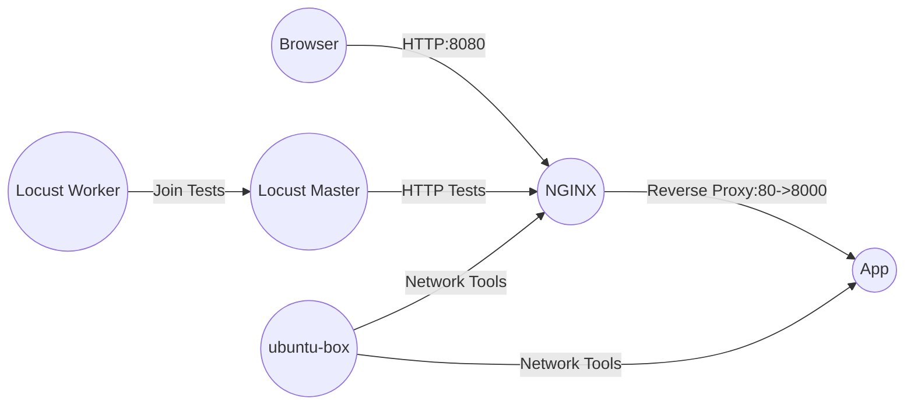

# Comprehensive and Detailed Explanation of `docker-compose.yml`

This document provides an extensive explanation of a Docker Compose setup that includes a versatile development container (**`ubuntu-box`**), along with examples of integrating a Python application, NGINX reverse proxy, Locust for load testing, and network analysis tools. By exploring these patterns, you can construct a stable, production-like development environment directly on your machine.

---

## Overview of Docker Compose

**Docker Compose** allows you to define and run multi-container Docker applications using a single YAML file. Once defined, `docker compose up` quickly brings your entire environment online. This approach:

- Ensures reproducibility across different machines and team members.
- Simplifies the orchestration of multiple, interconnected services.
- Streamlines local development and integration testing, as well as CI/CD workflows.

---

## Primary Service: `ubuntu-box`

**`ubuntu-box`** acts as a fully loaded development environment providing multiple languages, tools, and utilities so that you can code, test, and debug all in one place.

### Key Features of `ubuntu-box`

- **Multiple Runtimes**: Ruby (3.3.0), Python (3.12), Go (1.22.10), Node.js (20), Rust (stable), and Bun.
- **Developer Tools**: Git, Vim, Nano, build-essential, etc.
- **Network Diagnostics**: `nmap`, `traceroute`, `tcpdump`.
- **AWS CLI Support**: Read-only mounting of `~/.aws` credentials for seamless AWS integration.
- **Caching Volumes**: Speeds up dependency installations and builds.

### Base `docker-compose.yml`

```yaml
services:
  ubuntu-box:
    build:
      context: .
      dockerfile: Dockerfile
    volumes:
      - .:/app
      - ~/.aws:/root/.aws:ro
      - ~/.ssh:/root/.ssh:ro
      - uv_cache:/root/.cache/uv
      - bun_cache:/root/.bun/install/cache
      - go_cache:/go/pkg/mod
    environment:
      - AWS_DEFAULT_REGION=${AWS_DEFAULT_REGION:-ap-southeast-2}
      - DEBIAN_FRONTEND=noninteractive
      - PATH="/app/.venv/bin:/usr/local/go/bin:/root/.bun/bin:${PATH}"
    ports:
      - "3000:3000" # Node.js/Bun apps
      - "8000:8000" # Python apps
      - "9000:9000" # Go apps
    tty: true
    stdin_open: true
    command: /bin/bash
    container_name: ubuntu-box-2025

volumes:
  uv_cache:
  bun_cache:
  go_cache:
```

**Explanation**:

- **Mounting `.` to `/app`**: Edit code locally, run it instantly inside the container.
- **AWS & SSH Credentials**: Secure, read-only access to remote resources.
- **Environment Variables**: Non-interactive apt installations, default AWS region, and extended PATH.
- **Port Mappings**: Easily reach services from the host machine.
- **Interactive Shell**: `tty: true` and `stdin_open: true` allow direct interaction with `docker compose exec ubuntu-box bash`.
- **Caching Volumes**: Speeds up rebuilds and dependency downloads.

---

## Extended Use Cases

The `ubuntu-box` container is a versatile starting point. Compose truly shines when adding more services like a backend application, an NGINX proxy, and tools for load testing and network diagnostics.

---

### Adding an Application Service and NGINX Proxy

Consider adding a Python application (listening on `8000`) and front it with NGINX on `8080`. NGINX acts as a reverse proxy, forwarding traffic to the Python app. This setup mimics a production environment with a load balancer or reverse proxy in front.

**Traffic Flow**:



**Configuration Example**:

```yaml
services:
  ubuntu-box:
    # defined above, not repeated here

  app:
    image: python:3.12
    working_dir: /app
    volumes:
      - .:/app
    command: ["python3", "-m", "http.server", "8000"]
    expose:
      - "8000"

  nginx:
    image: nginx:latest
    depends_on:
      - app
    ports:
      - "8080:80"
    volumes:
      - ./nginx.conf:/etc/nginx/nginx.conf:ro
      - ./index.html:/usr/share/nginx/html/index.html:ro
```

**`nginx.conf`**:

```nginx
user nginx;
worker_processes auto;

events {
    worker_connections 1024;
}

http {
    include /etc/nginx/mime.types;
    default_type application/octet-stream;

    upstream backend {
        server app:8000;
    }

    server {
        listen 80;
        server_name localhost;

        location / {
            proxy_pass http://backend;
            proxy_set_header Host $host;
            proxy_set_header X-Real-IP $remote_addr;
            proxy_set_header X-Forwarded-For $proxy_add_x_forwarded_for;
        }

        location /index.html {
            root /usr/share/nginx/html;
        }
    }
}
```

**Key Points**:

- `index.html` is served directly by NGINX.
- Other requests are forwarded to `app:8000`.
- This pattern allows adding TLS, caching, or authentication at the proxy layer without changing the app.

---

### Load Testing with Locust

**Locust** simulates user traffic to test your application’s performance and reliability under load. Combined with NGINX and `app`, Locust can help you understand how your stack scales.

**Configuration**:

```yaml
services:
  locust-master:
    image: locustio/locust
    command: ["--master"]
    ports:
      - "8089:8089"
    volumes:
      - ./locustfile.py:/locustfile.py

  locust-worker:
    image: locustio/locust
    command: ["--worker", "--master-host=locust-master"]
    volumes:
      - ./locustfile.py:/locustfile.py
    depends_on:
      - locust-master
```

**`locustfile.py`**:

```python
from locust import HttpUser, task

class MyUser(HttpUser):
    @task
    def hit_root(self):
        self.client.get("/")
```

**Usage**:

1. Start all services:
   ```bash
   docker compose up
   ```
2. Open `http://localhost:8089` for the Locust UI.
3. Set target host to `http://nginx:80` or `http://localhost:8080`.
4. Run tests and observe metrics to identify performance bottlenecks.

---

### Enhanced Network Analysis with `nmap` and Other Tools

**Tools**: `nmap`, `traceroute`, `tcpdump`  
**Goal**: Diagnose connectivity, discover open ports, trace network paths, and capture traffic.

**Basic Internal Checks**:  
From `ubuntu-box`, you can directly test connectivity to other services by their Docker network hostnames:

```bash
docker compose exec ubuntu-box bash
nmap -p 8000 app
```

- `docker compose exec` attaches you to a running `ubuntu-box` container’s shell.
- `nmap -p 8000 app` checks if `app` is listening on port `8000`.
- No extra configuration is needed for these simple internal scans. Docker’s internal DNS resolves `app` automatically.

**Advanced Scenarios (Host Networking & Privileges)**:

If you need more advanced scanning (e.g., SYN scans, OS detection) or want to examine traffic at the host level, you may require `privileged: true` and `network_mode: host`.

Add a `network-tools` service to your `docker-compose.yml`:

```yaml
services:
  network-tools:
    build:
      context: .
      dockerfile: Dockerfile
    network_mode: "host" # Direct access to host's network stack
    privileged: true # Allows raw packet scans, tcpdump
    tty: true
    stdin_open: true
    command: ["/bin/bash"]
```

**Usage (Advanced)**:

```bash
docker compose up -d network-tools
docker compose exec network-tools bash
nmap -sS 192.168.1.1
traceroute google.com
tcpdump -i eth0
```

- `network_mode: host` & `privileged: true` enable low-level operations.
- Useful for diagnosing issues that simple internal scans don’t cover.

**Security Note**:  
`privileged: true` and `network_mode: host` reduce isolation. Use these settings only for debugging and never in production.

---

### Custom Ports and Additional Services

Want to serve content on a custom port (e.g., `42069`)?

```yaml
services:
  network-tools:
    build:
      context: .
      dockerfile: Dockerfile
    command: ["python3", "-m", "http.server", "42069"]
    expose:
      - "42069"
```

Check from `ubuntu-box`:

```bash
docker compose exec ubuntu-box bash
curl http://network-tools:42069
nmap -p 42069 network-tools
```

---

## Best Practices for Compose Files

1. **Use \*\***`.env`\***\* Files**: Keep environment variables in a `.env` file to maintain a clean `docker-compose.yml`. Docker Compose automatically loads a `.env` file located in the same directory as the `docker-compose.yml`. However, **these variables will not automatically appear in your app unless explicitly referenced in your \*\***`docker-compose.yml`\***\* file or passed to your app's configuration**.

   ### Example `.env` File:

   ```plaintext
   DB_USER=myuser
   DB_PASSWORD=mypassword
   APP_ENV=production
   ```

   ### Example `docker-compose.yml` File (Individual Environment Variables):

   ```yaml
   services:
     app:
       image: myapp:latest
       environment:
         - DB_USER=${DB_USER:-defaultuser} # Passed to the container from .env or uses default
         - DB_PASSWORD=${DB_PASSWORD:-defaultpassword} # Passed to the container from .env or uses default
         - APP_ENV=${APP_ENV:-development} # Passed to the container from .env or uses default
       ports:
         - "8080:8080"
   ```

   ### Example `docker-compose.yml` File (Whole `.env` File):

   ```yaml
   services:
     app:
       image: myapp:latest
       env_file:
         - .env # Loads all variables from the .env file
       ports:
         - "8080:8080"
   ```

   ### Command-Line Method:

   To pass environment variables from a custom `.env` file via the command line:

   ```bash
   docker compose --env-file custom.env up
   ```

   ### Key Explanation:

   - Variables in the `.env` file (e.g., `DB_USER`, `DB_PASSWORD`, `APP_ENV`) are automatically loaded by Docker Compose if the `.env` file is present in the same directory.
   - Using `env_file` in `docker-compose.yml` loads the entire file, while specifying individual variables in the `environment` section allows for selective usage.
   - The `${VARIABLE:-default}` syntax can be used to provide default values if a variable is missing from the `.env` file.
   - Command-line options like `--env-file` can override the default `.env` file and load a custom one.
   - **Important**: Even though `.env` is automatically loaded, the variables will not appear in the running container unless explicitly passed in the Compose file or via the command line.

2. **Named Networks**: For complex environments, define networks to isolate traffic:

   ```yaml
   networks:
     internal_net:
     external_net:

   services:
     app:
       networks:
         - internal_net
     nginx:
       networks:
         - internal_net
         - external_net
   ```

3. **Health Checks**: Ensure services are ready:

   ```yaml
   services:
     app:
       healthcheck:
         test: ["CMD", "curl", "-f", "http://localhost:8000"]
         interval: 10s
         timeout: 5s
         retries: 3
   ```

4. **Modular Compose Files**:  
   Split configurations into multiple files (`docker-compose.yml` for core, `docker-compose.test.yml` for testing, etc.) and combine them with `docker compose -f` options.

5. **Resource Limits**:  
   Simulate production constraints:

   ```yaml
   services:
     app:
       deploy:
         resources:
           limits:
             cpus: "0.5"
             memory: "512M"
   ```

---

## Next Steps & Scaling Up

- **CI/CD Integration**: Run these setups in CI to ensure consistent test environments.
- **Advanced Caching**: Use multi-stage builds for even faster iterations.
- **Monitoring & Logging**: Add Prometheus, Grafana, or ELK stack for deeper insights.
- **Security Hardening**: Keep credentials secure and use read-only mounts where possible.
- **Scaling Services**:
  ```bash
  docker compose up --scale locust-worker=5
  ```
  Easily increase the number of Locust workers for heavier load tests.

---

## Troubleshooting Tips

- **Container Start Failures**: Check logs with:
  ```bash
  docker compose logs -f <service>
  ```
- **Connectivity Issues**: Use `nmap` or `traceroute` from `ubuntu-box` or `network-tools`.
- **Permission Errors**: Adjust file permissions on host-mounted volumes.
- **Healthcheck Failures**: Verify the service is actually running and listening on the correct port.

---

## Conclusion

This comprehensive setup provides a rich environment that closely mimics real-world architectures. By combining `ubuntu-box`, NGINX, a backend app, Locust for load testing, and robust network analysis tools, you can efficiently develop, test, and refine your applications.

Use these patterns as a template, adjust them to your needs, and continuously evolve your environment for improved reliability, performance, and maintainability.
