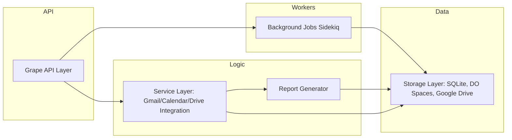

# Google Workspace Activity Tracker

A Design Document for a Ruby-Based Tracker

## 1. Introduction

The Google Workspace Activity Tracker is a Ruby application that monitors, analyzes, and reports on activities in Google Workspace. It relies on Grape for API endpoints, a SQLite database for persistence, and can store generated report files on DigitalOcean Spaces or Google Drive. This application can help keep track of calendar events, categorised emails (such as bills or important communications), and file operations. It also supports extracting information from attached PDFs to automate tasks like bill tracking.

## 2. Goals and Key Requirements

1. **Multi-Interval Activity Tracking**

   - Daily summaries for ongoing updates
   - Weekly rollups for trend spotting
   - Fortnightly two-week trends for medium-term analysis
   - Monthly overviews for strategic insights

2. **Email Monitoring**

   - Identify bill notifications
   - Filter important communications
   - Enforce custom rules by assigning categories

3. **PDF Processing and Bill Tracking**

   - Parse PDF attachments from emails to detect billing amounts or due dates
   - Use a Ruby gem like `pdf-reader` to extract text from PDF files
   - Store relevant metadata in the database for later reporting

4. **Organised Reporting**

   - Generate Markdown files in a hierarchical structure:
     ```plaintext
     reports/
     ├── daily/
     │   └── YYYY-MM-DD.md
     ├── weekly/
     │   └── YYYY-WW.md
     ├── fortnightly/
     │   └── YYYY-FF.md
     └── monthly/
         └── YYYY-MM.md
     ```

5. **Future-Ready Architecture**
   - Potential for advanced analytics and machine learning
   - Modular approach for easy addition of new data sources

---

## 3. High-Level Architecture



### 3.1 Grape API Layer

- Exposes RESTful endpoints for calendar events, emails, and file operations.
- Uses Grape Entities to present JSON responses consistently.

### 3.2 Background Jobs

- Sidekiq processes jobs asynchronously, such as sending reports and parsing PDF attachments.
- Schedules recurring tasks (daily, weekly, fortnightly, monthly) via `sidekiq-cron`.

### 3.3 Service Layer

- Core logic for interacting with Google APIs (Calendar, Gmail, Drive).
- Integrates with external libraries like `pdf-reader` to parse PDF attachments when relevant.

### 3.4 Storage Layer

- SQLite for structured data (events, emails, file operations, parsed PDF data).
- DigitalOcean Spaces or Google Drive for file storage.
- For better performance and concurrency, consider PostgreSQL in production.

### 3.5 Report Generator

- Collects data from the database and transforms it into Markdown reports.
- Saves reports locally and can optionally upload to DigitalOcean Spaces or Drive.

---

## 4. Database Design

ActiveRecord with SQLite is used by default. For larger teams, consider migrating to PostgreSQL or MySQL.

### 4.1 Models

```ruby
# app/models/calendar_event.rb
class CalendarEvent < ActiveRecord::Base
  validates :event_id, presence: true, uniqueness: true
  validates :summary, presence: true
  validates :start_time, presence: true

  scope :daily, -> { where(start_time: Time.current.beginning_of_day..Time.current.end_of_day) }
  scope :weekly, -> { where(start_time: Time.current.beginning_of_week..Time.current.end_of_week) }
  scope :fortnightly, -> { where(start_time: 2.weeks.ago..Time.current) }
  scope :monthly, -> { where(start_time: Time.current.beginning_of_month..Time.current.end_of_month) }
end

# app/models/tracked_email.rb
class TrackedEmail < ActiveRecord::Base
  validates :message_id, presence: true, uniqueness: true
  validates :subject, presence: true
  validates :sender, presence: true

  scope :bills, -> { where(category: 'bill') }
  scope :important, -> { where(category: 'important') }
  scope :unprocessed, -> { where(processed_at: nil) }
end

# app/models/file_operation.rb
class FileOperation < ActiveRecord::Base
  validates :file_id, presence: true
  validates :operation, presence: true, inclusion: { in: ['upload', 'download', 'move'] }
  validates :source, presence: true, inclusion: { in: ['drive', 'spaces'] }

  scope :pending, -> { where(status: 'pending') }
  scope :completed, -> { where(status: 'completed') }
  scope :failed, -> { where(status: 'failed') }
end
```

### 4.2 Storing Extracted PDF Data

If you want to parse PDFs for information (like bill amounts), consider a model that links to `TrackedEmail`:

```ruby
# app/models/pdf_extraction.rb
class PdfExtraction < ActiveRecord::Base
  belongs_to :tracked_email
  # Example fields: pdf_text, detected_amount, detected_due_date
end
```

### 4.3 Database Schema

```ruby
class CreateInitialTables < ActiveRecord::Migration[7.0]
  def change
    create_table :calendar_events do |t|
      t.string :event_id, null: false, index: { unique: true }
      t.string :summary, null: false
      t.datetime :start_time, null: false
      t.datetime :end_time
      t.boolean :recurring, default: false
      t.timestamps
    end

    create_table :tracked_emails do |t|
      t.string :message_id, null: false, index: { unique: true }
      t.string :subject, null: false
      t.string :sender, null: false
      t.string :category
      t.datetime :received_at
      t.datetime :processed_at
      t.timestamps
    end

    create_table :file_operations do |t|
      t.string :file_id, null: false
      t.string :operation, null: false
      t.string :source, null: false
      t.string :path
      t.string :status, default: 'pending'
      t.timestamps
    end

    create_table :pdf_extractions do |t|
      t.references :tracked_email, foreign_key: true
      t.text :pdf_text
      t.decimal :detected_amount
      t.date :detected_due_date
      t.timestamps
    end
  end
end
```

---

## 5. API Endpoints (Grape)

Below are the three main resources (CalendarEvents, TrackedEmails, FileOperations). Additional endpoints can be created for parsing PDFs.

```ruby
module GoogleWorkspace
  class API < Grape::API
    version 'v1', using: :header, vendor: 'google-workspace'
    format :json

    mount Resources::CalendarEvents
    mount Resources::TrackedEmails
    mount Resources::FileOperations
  end
end
```

---

## 6. PDF Processing for Bill Tracking

You can integrate a gem like `pdf-reader` to parse attached PDFs from emails. For example:

```ruby
require 'pdf-reader'

module Services
  class PdfParser
    def self.extract_info_from_file(file_path)
      reader = PDF::Reader.new(file_path)
      text_content = reader.pages.map(&:text).join("\n")

      # Simple example: detect an amount with a regex
      amount_match = text_content.match(/Amount Due:\s*\$?([\d\.]+)/)
      due_match = text_content.match(/Due Date:\s*([\d\/\-]+)/)

      {
        pdf_text: text_content,
        detected_amount: amount_match[1].to_f if amount_match,
        detected_due_date: Date.parse(due_match[1]) if due_match
      }
    end
  end
end
```

You would then save this data in a `PdfExtraction` record linked to the `TrackedEmail`.

---

## 7. Storage Integration

You can store generated reports or original PDFs in DigitalOcean Spaces. Since you are in Melbourne, the closest DigitalOcean region is Sydney (`syd1`).

```ruby
module Storage
  class SpacesClient
    def initialize
      @spaces = Aws::S3::Client.new(
        access_key_id: ENV['SPACES_KEY'],
        secret_access_key: ENV['SPACES_SECRET'],
        endpoint: "https://syd1.digitaloceanspaces.com",
        region: 'syd1'
      )
    end

    def upload(file_path, destination)
      @spaces.put_object(
        bucket: ENV['SPACES_BUCKET'],
        key: destination,
        body: File.read(file_path),
        acl: 'private'
      )
    end
  end
end
```

---

## 8. Report Generation

Below is a sample daily report generator that collects calendar events and tracked emails for the current day, writes them to a Markdown file, and optionally uploads to Spaces:

```ruby
module Reports
  class DailyReport
    def generate
      events = CalendarEvent.daily
      emails = TrackedEmail.where(
        received_at: Time.current.beginning_of_day..Time.current.end_of_day
      )

      markdown = "# Daily Report - #{Date.today}\n\n"
      markdown += generate_calendar_section(events)
      markdown += generate_email_section(emails)

      save_report('daily', markdown)
    end

    private

    def generate_calendar_section(events)
      section = "## Calendar Events\n\n"
      events.each do |event|
        section += "- #{event.summary} (Start: #{event.start_time}, End: #{event.end_time})\n"
      end
      section + "\n"
    end

    def generate_email_section(emails)
      section = "## Tracked Emails\n\n"
      emails.each do |email|
        section += "- #{email.subject} from #{email.sender}\n"
      end
      section + "\n"
    end

    def save_report(type, content)
      path = "reports/#{type}/#{Date.today}.md"
      File.write(path, content)
      Storage::SpacesClient.new.upload(path, path)
    end
  end
end
```

---

## 9. Background Jobs

Use Sidekiq for asynchronous tasks and `sidekiq-cron` for scheduled jobs. An example `config/schedule.yml`:

```yaml
daily_report:
  cron: "0 0 * * *"
  class: "Reports::DailyReportJob"

weekly_report:
  cron: "0 0 * * 0"
  class: "Reports::WeeklyReportJob"

fortnightly_report:
  cron: "0 0 1,15 * *"
  class: "Reports::FortnightlyReportJob"

monthly_report:
  cron: "0 0 1 * *"
  class: "Reports::MonthlyReportJob"
```

```ruby
module Reports
  class DailyReportJob
    include Sidekiq::Worker

    def perform
      DailyReport.new.generate
    end
  end
end
```

---

## 10. Environment Configuration

Use a `.env` file to store credentials:

```bash
# .env.example
GOOGLE_CLIENT_ID=xxx
GOOGLE_CLIENT_SECRET=xxx
SPACES_KEY=xxx
SPACES_SECRET=xxx
SPACES_BUCKET=workspace-reports
REDIS_URL=redis://localhost:6379/0

# For DigitalOcean Sydney region
SPACES_REGION=syd1
```

---

## 11. Deployment Notes

- You can deploy to DigitalOcean using App Platform, Managed Redis, and Spaces (set to `syd1`).
- Consider using PostgreSQL in production.
- Automate database backups (for example, via cron jobs or scheduled tasks).

---

## 12. Use Cases

1. **Bill Tracking**

   - Gathers emails marked with the `bill` category.
   - Parses attached PDFs to detect amounts, due dates, or invoice numbers.
   - Generates scheduled summary reports.

2. **Calendar Analysis**

   - Tracks how many events occur daily, weekly, or monthly.
   - Summarises recurring events or unprocessed invites.

3. **Email Insights**

   - Highlights important communications.
   - Flags emails by subject or sender for follow-up.

4. **File Operation Audits**
   - Logs uploads, downloads, and moves across Google Drive or Spaces.
   - Useful for compliance or verifying backups.

---

## 13. Setup Instructions

1. **Clone the Repository**
   ```bash
   git clone https://github.com/username/google-workspace-activity-tracker.git
   cd google-workspace-activity-tracker
   ```
2. **Copy `.env.example` to `.env` and Update Credentials**
3. **Install Dependencies**
   ```bash
   bundle install
   ```
4. **Run Migrations**
   ```bash
   rake db:migrate
   ```
5. **Start Sidekiq**
   ```bash
   bundle exec sidekiq
   ```
6. **Start the API Server**
   ```bash
   bundle exec rackup
   ```
7. **Check Endpoints**
   - Visit `http://localhost:9292` to confirm the API is running (or another port if specified).

---

## 14. Conclusion

This document outlines how to build and run a comprehensive activity tracker for Google Workspace. It covers storing and parsing PDF attachments to support bill tracking, generating scheduled reports, and providing a clean API via Grape. Since you are in Melbourne, Sydney (`syd1`) on DigitalOcean is likely the best region option for lower latency. This solution is ready for further enhancements such as machine learning for email classification, custom report templates, or multi-user authentication.
